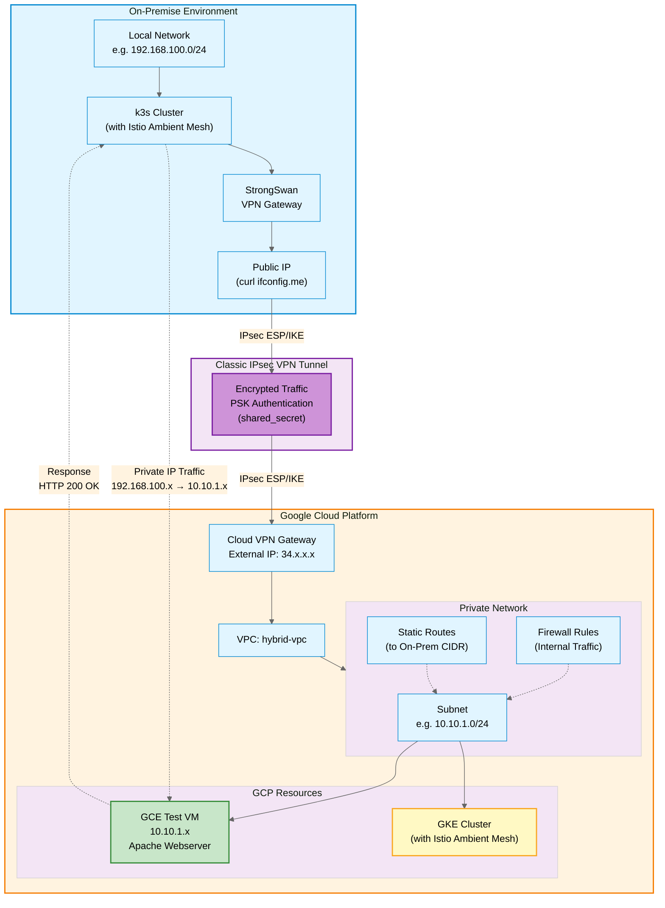

# Hybrid Cloud Multicluster Lab

> Connect your local Kubernetes cluster to Google Cloud Platform using VPN and prepare for Istio Ambient Mesh multicluster setup.

## Overview

This lab demonstrates how to build a **hybrid cloud environment** where your local network (on-prem) communicates securely with a GCP VPC using Cloud VPN. This foundation enables multicluster service mesh deployments between k3s (local) and Google Kubernetes Engine (GCP).



## Features

- **Secure VPN Connection** between on-prem and GCP using IPsec
- **Private IP Communication** across hybrid environments
- **Terraform Automation** for GCP infrastructure
- **StrongSwan Configuration** for local VPN gateway
- **Test VM** with Apache webserver for validation
- **GKE Cluster Ready** for Istio Ambient Mesh

## Prerequisites

### Local Environment (On-Prem)
- Ubuntu 24.04 or similar Linux distribution
- Public IP address (not behind CGNAT)
- StrongSwan installed
- Private network CIDR (e.g., `192.168.100.0/24`)

### Google Cloud Platform
- Active GCP project
- gcloud CLI installed and configured
- Terraform >= 1.0
- Required APIs enabled:
  - Compute Engine API
  - Kubernetes Engine API

### Tools
```bash
# Install required tools
sudo apt-get update
sudo apt-get install -y curl git terraform strongswan strongswan-pki

# Verify installations
terraform --version
ipsec --version
```

## Quick Start

### 1. Clone the Repository

```bash
git clone https://github.com/salvadorarreola/hybrid-cloud-multicluster-lab.git
cd hybrid-cloud-multicluster-lab
```

### 2. Get Your Network Information

```bash
# Get your public IP
curl -4 https://ifconfig.me

# Check your local network CIDR
ip addr show | grep inet
# Example output: 192.168.100.0/24
```

### 3. Deploy GCP Infrastructure

```bash
cd cloud/terraform/gcp-network

# Set required variables
export TF_VAR_project_id="your-gcp-project-id"
export TF_VAR_onprem_cidr="192.168.100.0/24"  # Your local network
export TF_VAR_onprem_ip="203.0.113.1"         # Your public IP

# Initialize and apply Terraform
terraform init
terraform plan
terraform apply
```

**Important Outputs:**
```bash
# Save these values
terraform output vpn_gateway_ip     # GCP VPN Gateway IP
terraform output shared_secret      # PSK for VPN authentication
```

### 4. Configure Local VPN (StrongSwan)

Edit the configuration files in `on-prem/local-vpn-config/`:

#### `ipsec.conf`
```bash
cd ../../on-prem/local-vpn-config

# Edit ipsec.conf with your values
nano ipsec.conf
```

Replace:
- `<YOUR_ONPREM_PUBLIC_IP>` → Your public IP (from step 2)
- `<YOUR_ONPREM_CIDR>` → Your local network CIDR (e.g., `192.168.100.0/24`)
- `<GCP_VPN_GATEWAY_IP>` → From terraform output
- `<GCP_SUBNET_CIDR>` → `10.10.1.0/24` (default)

#### `ipsec.secrets`
```bash
nano ipsec.secrets
```

Replace:
- `<YOUR_ONPREM_PUBLIC_IP>` → Your public IP
- `<GCP_VPN_GATEWAY_IP>` → From terraform output
- `SHARED_SECRET` → From `terraform output shared_secret`

#### Copy and Start StrongSwan

```bash
# Copy configuration files
sudo cp ipsec.conf /etc/ipsec.conf
sudo cp ipsec.secrets /etc/ipsec.secrets

# Set proper permissions
sudo chmod 600 /etc/ipsec.secrets

# Start VPN
sudo ipsec restart

# Check status
sudo ipsec statusall
```

### 5. Validate the Connection

#### Check VPN Tunnel Status
```bash
sudo ipsec statusall

# Expected output should show:
# Security Associations (1 up, 0 connecting):
#   gcp-vpn[1]: ESTABLISHED
```

#### Test Connectivity to GCP VM
```bash
# Get the test VM internal IP from Terraform
cd ../cloud/terraform/gcp-network
terraform output

# Test connection
curl -i http://10.10.1.X

# Expected response:
# HTTP/1.1 200 OK
# Page served from: test-vm
```

## Architecture Details

### Network Configuration

| Component | CIDR/IP | Description |
|-----------|---------|-------------|
| On-Prem Network | `192.168.100.0/24` | Local private network |
| GCP VPC Subnet | `10.10.1.0/24` | GCP subnet for VMs and GKE |
| GKE Pod CIDR | `10.48.0.0/14` | IP range for Kubernetes pods |
| GKE Service CIDR | `10.52.0.0/16` | IP range for Kubernetes services |
| VPN Gateway (GCP) | `34.x.x.x` | Public IP for VPN endpoint |

### Resources Created by Terraform

#### GCP Network Module (`cloud/terraform/gcp-network`)
- ✅ VPC network (`hybrid-vpc`)
- ✅ Subnet (`10.10.1.0/24`)
- ✅ Classic VPN Gateway
- ✅ Static external IP for VPN
- ✅ Forwarding rules (ESP, UDP 500, UDP 4500)
- ✅ VPN tunnel to on-prem
- ✅ Route to on-prem network
- ✅ Firewall rule for HTTP from on-prem
- ✅ Test VM with Apache webserver (Spot instance)

#### GKE Cluster Module (`cloud/terraform/gke-cluster`)
- ✅ Private GKE cluster
- ✅ Node pool with Spot instances
- ✅ Autoscaling configuration
- ✅ Private nodes with public endpoint

## Configuration Files

### Terraform Variables

#### `gcp-network/variables.tf`
```hcl
variable "project_id" {}        # Required: Your GCP project ID
variable "region" {             # Default: us-central1
  default = "us-central1"
}
variable "onprem_cidr" {}       # Required: Your local network CIDR
variable "onprem_ip" {}         # Required: Your public IP
variable "gcp_subnet_cidr" {    # Default: 10.10.1.0/24
  default = "10.10.1.0/24"
}
```

### StrongSwan Configuration

#### Encryption Settings
- **IKE**: `aes256-sha256-modp2048`
- **ESP**: `aes256-sha256`
- **Key Exchange**: IKEv2
- **Authentication**: Pre-Shared Key (PSK)

#### Connection Parameters
- **DPD Delay**: 30s
- **DPD Timeout**: 120s
- **Auto**: start
- **Close Action**: restart

## Next Steps

### Deploy GKE Cluster
```bash
cd cloud/terraform/gke-cluster

export TF_VAR_project_id="your-gcp-project-id"

terraform init
terraform apply

# Get cluster credentials
gcloud container clusters get-credentials gke-ambient-multicluster --region=us-central1
```

### Prepare for Istio Ambient Mesh
The next phase involves:
- Installing Istio Ambient Mesh on both clusters
- Configuring multicluster communication
- Deploying sample applications
- Setting up cross-cluster service discovery

Stay tuned for the next guide: **"Creating a Multi-Cluster Environment with Istio Ambient Mesh (k3s + GKE)"**

## Troubleshooting

### VPN Tunnel Not Establishing

**Check VPN status:**
```bash
sudo ipsec statusall
sudo ipsec up gcp-vpn
```

**Common issues:**
1. **Incorrect public IP**: Verify with `curl -4 https://ifconfig.me`
2. **Firewall blocking**: Check if your ISP/router allows IPsec traffic (ESP, UDP 500, 4500)
3. **Wrong shared secret**: Verify `terraform output shared_secret` matches `ipsec.secrets`

**Check logs:**
```bash
sudo journalctl -u strongswan -f
sudo tail -f /var/log/syslog | grep charon
```

### Cannot Reach GCP VM

**Verify tunnel is up:**
```bash
sudo ipsec statusall | grep ESTABLISHED
```

**Check routing:**
```bash
ip route show table 220
# Should show route to 10.10.1.0/24
```

**Test from both sides:**
```bash
# From local
ping 10.10.1.2

# From GCP VM (via SSH)
ping 192.168.100.1
```

### Terraform Issues

**State locked:**
```bash
terraform force-unlock <LOCK_ID>
```

**API not enabled:**
```bash
gcloud services enable compute.googleapis.com
gcloud services enable container.googleapis.com
```

### Destroy Resources When Not in Use
```bash
# Destroy GKE cluster
cd cloud/terraform/gke-cluster
terraform destroy

# Destroy network infrastructure
cd ../gcp-network
terraform destroy
```

## Resources

- [Google Cloud VPN Documentation](https://cloud.google.com/network-connectivity/docs/vpn)
- [StrongSwan Documentation](https://docs.strongswan.org/)
- [Istio Ambient Mesh](https://istio.io/latest/docs/ambient/)
- [GKE Private Clusters](https://cloud.google.com/kubernetes-engine/docs/how-to/private-clusters)

---

**Note**: This lab uses Classic VPN for simplicity. For production workloads, consider using [HA VPN](https://cloud.google.com/network-connectivity/docs/vpn/concepts/overview#ha-vpn) which provides 99.99% SLA.