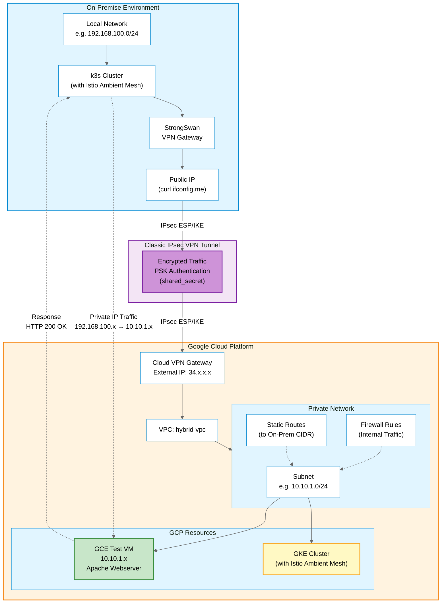

# Hybrid Cloud Lab: Connect Your Local Network to Google Cloud

> Build a secure VPN connection between your on-premise environment and Google Cloud Platform using Terraform and StrongSwan.

## Overview

This lab demonstrates how to build a **hybrid cloud environment** where your local network (on-prem) communicates securely with a GCP VPC using Cloud VPN. This setup enables private IP communication between your local infrastructure and cloud resources.

## Architecture



### What You'll Build

- **Secure VPN Connection** between on-prem and GCP using IPsec
- **Private IP Communication** across hybrid environments
- **GCP VPC** with subnet and networking resources
- **Test VM** with Apache webserver for validation

### Key Components

- **VPC**: Your private GCP network
- **VPN Gateway**: Encrypts traffic between both sites
- **Routes**: Define how subnets communicate
- **Firewall Rules**: Control traffic flow between networks

## Prerequisites

### Local Environment (On-Prem)

- Ubuntu 24.04 or similar Linux distribution
- Public IP address (not behind CGNAT)
- Private network CIDR (e.g., `192.168.100.0/24`)
- Root or sudo access

### Google Cloud Platform

- Active GCP project
- gcloud CLI installed and configured
- Terraform >= 1.0
- Compute Engine API enabled

### Required Tools

```bash
# Install required tools
sudo apt-get update
sudo apt-get install -y curl git terraform strongswan strongswan-pki

# Authenticate with GCP
gcloud auth application-default login

# Enable required APIs
gcloud services enable compute.googleapis.com
```

## Getting Started

### Step 1: Gather Your Network Information

Before starting, you need two critical pieces of information:

**1. Your Public IP Address:**
```bash
curl -4 https://ifconfig.me
```
This is your `TF_VAR_onprem_ip` value.

**2. Your Local Network CIDR:**
```bash
ip addr show | grep inet
```
Example: `192.168.100.0/24` - This is your `TF_VAR_onprem_cidr` value.

### Step 2: Deploy GCP Infrastructure

Clone the repository and navigate to the GCP network module:

```bash
git clone https://github.com/salvador-arreola/hybrid-cloud-multicluster-lab.git
cd hybrid-cloud-multicluster-lab/cloud/terraform/gcp-network
```

Set your environment variables:

```bash
export TF_VAR_project_id="your-gcp-project-id"
export TF_VAR_onprem_cidr="192.168.100.0/24"    # Your local network CIDR
export TF_VAR_onprem_ip="203.0.113.1"           # Your public IP
```

Deploy the infrastructure:

```bash
terraform init
terraform plan
terraform apply
```

**Important:** Save the following outputs for the next step:

```bash
# View all outputs
terraform output

# Get specific values
terraform output vpn_gateway_ip      # GCP VPN Gateway IP
terraform output shared_secret       # PSK for VPN authentication
terraform output test_vm_private_ip  # Test VM internal IP
```

#### What Gets Created

The Terraform module creates:

- **VPC Network**: `hybrid-vpc`
- **Subnet**: `10.10.1.0/24` (default, configurable)
- **Classic VPN Gateway** with static external IP
- **Forwarding Rules**: ESP, UDP 500, UDP 4500
- **VPN Tunnel** to your on-prem public IP
- **Route** to your on-prem network
- **Firewall Rules** for internal communication
- **Test VM**: GCE instance with Apache webserver (Spot instance)

### Step 3: Configure Local VPN (StrongSwan)

Install StrongSwan on your local machine:

```bash
sudo apt-get update
sudo apt-get install strongswan strongswan-pki -y
```

Navigate to the configuration templates:

```bash
cd ../../on-prem/local-vpn-config
```

#### Configure ipsec.conf

Copy the template and edit with your values:

```bash
sudo cp ipsec.conf /etc/ipsec.conf
sudo nano /etc/ipsec.conf
```

Update the following fields:

```bash
# Local network configuration
leftsubnet=<YOUR_ONPREM_CIDR>           # e.g., 192.168.100.0/24

# GCP configuration
right=<GCP_VPN_GATEWAY_IP>              # From terraform output
rightid=<GCP_VPN_GATEWAY_IP>            # Same as above
rightsubnet=<GCP_SUBNET_CIDR>           # Default: 10.10.1.0/24
```

#### Configure ipsec.secrets

Copy the template and edit with your shared secret:

```bash
sudo cp ipsec.secrets /etc/ipsec.secrets
sudo nano /etc/ipsec.secrets
```

Update with the shared secret from Terraform:

```bash
: PSK "<SHARED_SECRET>"                 # From terraform output shared_secret
```

Set proper permissions:

```bash
sudo chmod 600 /etc/ipsec.secrets
```

#### Start the VPN

```bash
# Restart StrongSwan
sudo ipsec restart

# Check status
sudo ipsec statusall
```

Expected output should show:

```
Security Associations (1 up, 0 connecting):
  gcp-vpn[1]: ESTABLISHED
```

### Step 4: Validate the Connection

#### Check VPN Tunnel Status

```bash
sudo ipsec statusall
```

Look for `ESTABLISHED` status and active security associations.

#### Test Connectivity to GCP

Get the test VM private IP from Terraform output:

```bash
cd ../../cloud/terraform/gcp-network
terraform output test_vm_private_ip
```

Test the connection from your local machine:

```bash
curl -i http://10.10.1.x
```

Expected response:

```
HTTP/1.1 200 OK
Date: Tue, 11 Nov 2025 03:06:11 GMT
Server: Apache/2.4.65 (Debian)
Last-Modified: Tue, 11 Nov 2025 03:02:43 GMT
ETag: "1a-64348e1ae1e97"
Accept-Ranges: bytes
Content-Length: 26
Content-Type: text/html

Page served from: test-vm
```

If you see this response, **your hybrid cloud connection is working!**

## Network Configuration

| Component | CIDR/IP | Description |
|-----------|---------|-------------|
| On-Prem Network | `192.168.100.0/24` | Local private network (example) |
| GCP VPC Subnet | `10.10.1.0/24` | GCP subnet for resources |
| VPN Gateway (GCP) | `34.x.x.x` | Public IP for VPN endpoint |
| Test VM | `10.10.1.x` | Internal IP of test VM |

## Configuration Details

### Terraform Variables

Available in `cloud/terraform/gcp-network/variables.tf`:

| Variable | Description | Required | Default |
|----------|-------------|----------|---------|
| `project_id` | Your GCP project ID | Yes | - |
| `region` | GCP region for resources | No | `us-central1` |
| `onprem_cidr` | Your local network CIDR | Yes | - |
| `onprem_ip` | Your public IP address | Yes | - |
| `gcp_subnet_cidr` | GCP subnet range | No | `10.10.1.0/24` |

### StrongSwan VPN Settings

The VPN connection uses the following security parameters:

**Encryption:**
- IKE: `aes256-sha256-modp2048`
- ESP: `aes256-sha256`
- Key Exchange: IKEv2
- Authentication: Pre-Shared Key (PSK)

**Connection Parameters:**
- DPD Delay: 30s
- DPD Timeout: 120s
- Auto: start
- Close Action: restart

## Troubleshooting

### VPN Tunnel Not Establishing

**Check VPN status:**
```bash
sudo ipsec statusall
sudo ipsec up gcp-vpn
```

**Common issues:**

1. **Incorrect public IP**: Verify with `curl -4 https://ifconfig.me`
2. **Firewall blocking**: Check if your ISP/router allows IPsec traffic (ESP, UDP 500, 4500)
3. **Wrong shared secret**: Verify `terraform output shared_secret` matches `ipsec.secrets`
4. **CGNAT**: If behind carrier-grade NAT, you may need a different approach

**Check logs:**
```bash
sudo journalctl -u strongswan -f
sudo tail -f /var/log/syslog | grep charon
```

### Cannot Reach GCP VM

**Verify tunnel is up:**
```bash
sudo ipsec statusall | grep ESTABLISHED
```

**Check routing:**
```bash
ip route show table 220
# Should show route to 10.10.1.0/24
```

**Test from both sides:**
```bash
# From local
ping 10.10.1.2

# From GCP (if needed, SSH to test VM via Console)
# ping 192.168.100.1
```

### Terraform Issues

**API not enabled:**
```bash
gcloud services enable compute.googleapis.com
```

**Authentication issues:**
```bash
gcloud auth application-default login
```

## Cleanup

To destroy the resources when no longer needed:

```bash
cd cloud/terraform/gcp-network
terraform destroy
```

**Note:** This will delete all resources created by Terraform, including the VPN gateway and test VM.

## Important Notes

### Classic VPN vs HA VPN

This lab uses **Classic VPN** for simplicity and cost-effectiveness during development and testing.

**For production workloads**, consider using [HA VPN](https://cloud.google.com/network-connectivity/docs/vpn/concepts/overview#ha-vpn):
- 99.99% SLA
- Two redundant tunnels
- Better availability
- Automatic failover

### Cost Considerations

Resources that incur costs:
- VPN Gateway (hourly charge)
- VPN Tunnel (hourly charge)
- VM Instance (Spot instance - lower cost)
- Network egress traffic

Destroy resources when not in use to avoid unnecessary charges.

## Next Steps

This hybrid cloud foundation is ready for advanced use cases:

- **Multi-cluster Service Mesh**: Deploy Istio Ambient Mesh across k3s and GKE
- **Hybrid Workloads**: Run applications that span on-prem and cloud
- **Data Synchronization**: Connect databases across environments
- **Disaster Recovery**: Set up backup and recovery across sites

Stay tuned for the next guide: **"Creating a Multi-Cluster Environment with Istio Ambient Mesh (k3s + GKE)"**

## Resources

- **GitHub Repository**: [salvador-arreola/hybrid-cloud-multicluster-lab](https://github.com/salvador-arreola/hybrid-cloud-multicluster-lab)
- **Google Cloud VPN**: https://cloud.google.com/network-connectivity/docs/vpn/concepts/classic-topologies
- **StrongSwan Documentation**: https://docs.strongswan.org/
- **Terraform Google Provider**: https://registry.terraform.io/providers/hashicorp/google/latest/docs

## Related Blog Posts

- [Building a Hybrid Cloud: Connect Your Local Network to Google Cloud](https://medium.com/@salvadorarreolaro/building-a-hybrid-cloud-connect-your-local-network-to-google-cloud-c0df35ef84e6)

---

**License**: MIT
**Author**: Salvador Arreola