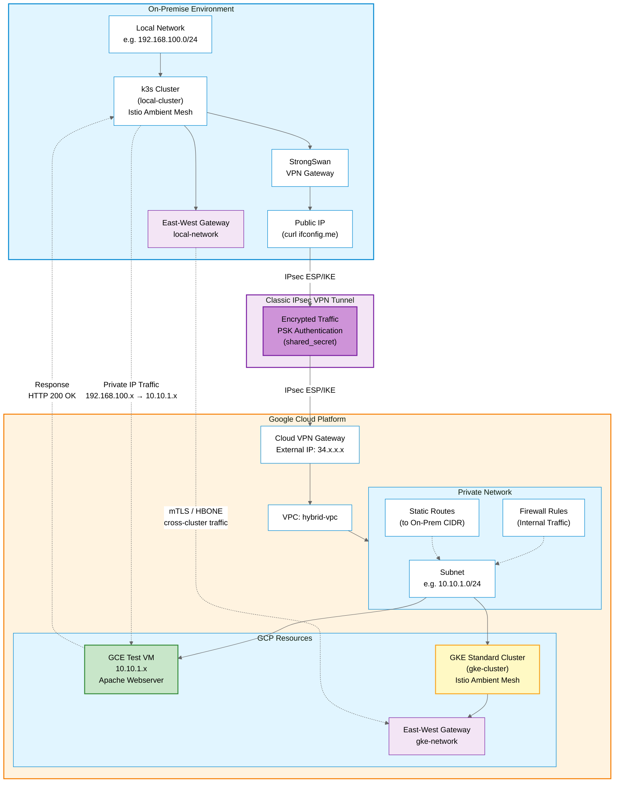

# Hybrid Cloud Lab: Connect Your Local Network to Google Cloud

> Build a secure VPN connection between your on-premise environment and Google Cloud Platform using Terraform and StrongSwan.

## Overview

This lab demonstrates how to build a **hybrid cloud environment** where your local network (on-prem) communicates securely with a GCP VPC using Cloud VPN. This setup enables private IP communication between your local infrastructure and cloud resources.

## Architecture



### What You'll Build

**Part 1 Hybrid Cloud VPN:**
- **Secure VPN Connection** between on-prem and GCP using IPsec
- **Private IP Communication** across hybrid environments
- **GCP VPC** with subnet and networking resources
- **Test VM** with Apache webserver for validation

**Part 2 Multi-Cluster Service Mesh:**
- **GKE Standard Cluster** on GCP
- **k3s Cluster** on-prem (co-located with the VPN host)
- **Istio Ambient Mesh** on both clusters sharing a single trust domain
- **East-West Gateways** for encrypted cross-cluster traffic over the VPN
- **Cross-cluster service discovery** so workloads call each other by DNS

### Key Components

- **VPC**: Your private GCP network
- **VPN Gateway**: Encrypts traffic between both sites
- **Routes**: Define how subnets communicate
- **Firewall Rules**: Control traffic flow between networks

## Prerequisites

### Local Environment (On-Prem)

- Ubuntu 24.04 or similar Linux distribution
- Public IP address (not behind CGNAT)
- Private network CIDR (e.g., `192.168.100.0/24`)
- Root or sudo access

### Google Cloud Platform

- Active GCP project
- gcloud CLI installed and configured
- Terraform >= 1.14
- Compute Engine API and Kubernetes Engine API enabled

### Required Tools

```bash
# Install required tools
sudo apt-get update
sudo apt-get install -y curl git terraform strongswan strongswan-pki

# Install kubectl
curl -LO "https://dl.k8s.io/release/$(curl -L -s https://dl.k8s.io/release/stable.txt)/bin/linux/amd64/kubectl"
sudo install -o root -g root -m 0755 kubectl /usr/local/bin/kubectl

# Install Helm
curl https://raw.githubusercontent.com/helm/helm/main/scripts/get-helm-3 | bash

# Authenticate with GCP
gcloud auth application-default login

# Enable required APIs
gcloud services enable compute.googleapis.com container.googleapis.com
```

## Getting Started

### Step 1: Gather Your Network Information

Before starting, you need two critical pieces of information:

**1. Your Public IP Address:**
```bash
curl -4 https://ifconfig.me
```
This is your `TF_VAR_onprem_ip` value.

**2. Your Local Network CIDR:**
```bash
ip addr show | grep inet
```
Example: `192.168.100.0/24` - This is your `TF_VAR_onprem_cidr` value.

### Step 2: Deploy GCP Infrastructure

Clone the repository and navigate to the GCP network module:

```bash
git clone https://github.com/salvador-arreola/hybrid-cloud-multicluster-lab.git
cd hybrid-cloud-multicluster-lab/cloud/terraform/gcp-network
```

Set your environment variables:

```bash
export TF_VAR_project_id="<YOUR-GCP-PROJECT-ID>"
export TF_VAR_onprem_cidr="192.168.100.0/24"    # Your local network CIDR
export TF_VAR_onprem_ip="<YOUR-PUBLIC-IP>"           # Your public IP
```

Deploy the infrastructure:

```bash
terraform init
terraform plan
terraform apply
```

**Important:** Save the following outputs for the next step:

```bash
# View all outputs
terraform output

# Get specific values
terraform output vpn_gateway_ip      # GCP VPN Gateway IP
terraform output shared_secret       # PSK for VPN authentication
terraform output test_vm_private_ip  # Test VM internal IP
```

#### What Gets Created

The Terraform module creates:

- **VPC Network**: `hybrid-vpc`
- **Subnet**: `10.10.1.0/24` (default, configurable)
- **Classic VPN Gateway** with static external IP
- **Forwarding Rules**: ESP, UDP 500, UDP 4500
- **VPN Tunnel** to your on-prem public IP
- **Route** to your on-prem network
- **Firewall Rules** for internal communication
- **Test VM**: GCE instance with Apache webserver (Spot instance)

### Step 3: Configure Local VPN (StrongSwan)

Install StrongSwan on your local machine:

```bash
sudo apt-get update
sudo apt-get install strongswan strongswan-pki -y
```

Navigate to the configuration templates:

```bash
cd ../../on-prem/local-vpn-config
```

#### Configure ipsec.conf

Copy the template and edit with your values:

```bash
sudo cp ipsec.conf /etc/ipsec.conf
sudo nano /etc/ipsec.conf
```

Update the following fields:

```bash
# Local network configuration
leftsubnet=<YOUR_ONPREM_CIDR>           # e.g., 192.168.100.0/24

# GCP configuration
right=<GCP_VPN_GATEWAY_IP>              # From terraform output
rightid=<GCP_VPN_GATEWAY_IP>            # Same as above
rightsubnet=<GCP_SUBNET_CIDR>           # Default: 10.10.1.0/24
```

#### Configure ipsec.secrets

Copy the template and edit with your shared secret:

```bash
sudo cp ipsec.secrets /etc/ipsec.secrets
sudo nano /etc/ipsec.secrets
```

Update with the shared secret from Terraform:

```bash
: PSK "<SHARED_SECRET>"                 # From terraform output shared_secret
```

Set proper permissions:

```bash
sudo chmod 600 /etc/ipsec.secrets
```

#### Start the VPN

```bash
# Restart StrongSwan
sudo ipsec restart

# Check status
sudo ipsec statusall
```

Expected output should show:

```
Security Associations (1 up, 0 connecting):
  gcp-vpn[1]: ESTABLISHED
```

### Step 4: Validate the Connection

#### Check VPN Tunnel Status

```bash
sudo ipsec statusall
```

Look for `ESTABLISHED` status and active security associations.

#### Test Connectivity to GCP

Get the test VM private IP from Terraform output:

```bash
cd ../../cloud/terraform/gcp-network
terraform output test_vm_private_ip
```

Test the connection from your local machine:

```bash
curl -i http://10.10.1.x
```

Expected response:

```
HTTP/1.1 200 OK
Date: Tue, 11 Nov 2025 03:06:11 GMT
Server: Apache/2.4.65 (Debian)
Last-Modified: Tue, 11 Nov 2025 03:02:43 GMT
ETag: "1a-64348e1ae1e97"
Accept-Ranges: bytes
Content-Length: 26
Content-Type: text/html

Page served from: test-vm
```

If you see this response, **your hybrid cloud connection is working!**

---

## Part 2: Multi-Cluster Service Mesh with Istio Ambient

> **Prerequisite:** Complete Part 1 and confirm the VPN tunnel is `ESTABLISHED` before continuing.

### Step 5: Deploy GKE Cluster

If you used a free GCP account and still have the test VM running, remove it first to avoid quota issues:

```bash
cd cloud/terraform/gcp-network
terraform destroy -target=google_compute_instance.test_vm
```

Deploy the GKE Standard cluster:

```bash
cd ../gke-cluster
terraform init && terraform apply
```

Expected outputs:

```
cluster_name            = "gke-ambient-multicluster"
get_credentials_command = "gcloud container clusters get-credentials gke-ambient-multicluster --region=us-central1"
```

After GKE is up, update StrongSwan to route GKE Pod and Service CIDRs over the tunnel:

```bash
sudo nano /etc/ipsec.conf
# Update rightsubnet to include GKE Pod and Service CIDRs:
# rightsubnet=10.10.1.0/24,10.48.0.0/14,10.52.0.0/16

sudo ipsec restart
sudo ipsec statusall
```

The tunnel should show `ESTABLISHED` again.

### Step 6: Deploy k3s Cluster (On-Prem)

Install k3s on the same machine that runs StrongSwan:

```bash
curl -sfL https://get.k3s.io | sh -
```

Merge kubeconfigs so both clusters are accessible from one file. Use the machine's LAN IP (not `127.0.0.1`) so Istio can reach the API server over the VPN:

```bash
sudo cp /etc/rancher/k3s/k3s.yaml ~/.kube/k3s.yaml
sudo chown $(id -u):$(id -g) ~/.kube/k3s.yaml
sed -i "s/127.0.0.1/<LOCAL_K3S_SERVER_IP>/" ~/.kube/k3s.yaml

KUBECONFIG=~/.kube/config:~/.kube/k3s.yaml kubectl config view --merge --flatten > ~/.kube/config-merged
mv ~/.kube/config-merged ~/.kube/config

kubectl config rename-context default k3s-local
```

Set context variables used throughout the remaining steps:

```bash
export CTX_GKE=<GKE_CTX_NAME>   # from: kubectl config get-contexts
export CTX_LOCAL=k3s-local
```

### Step 7: Install Istio Ambient Mesh

#### 7a. Download Istio and generate shared CA certificates

```bash
cd ~
ISTIO_VERSION=$(curl -sL https://github.com/istio/istio/releases/latest \
  | grep -oP 'releases/tag/\K[0-9]+\.[0-9]+\.[0-9]+' | head -1)
curl -L https://istio.io/downloadIstio | ISTIO_VERSION="${ISTIO_VERSION}" TARGET_ARCH=x86_64 sh -
cd istio-${ISTIO_VERSION}
export PATH=$PWD/bin:$PATH
```

Generate a shared root CA and per-cluster intermediate certs (required for cross-cluster mTLS):

```bash
mkdir -p certs && pushd certs

make -f ../tools/certs/Makefile.selfsigned.mk root-ca
make -f ../tools/certs/Makefile.selfsigned.mk gke-cacerts
make -f ../tools/certs/Makefile.selfsigned.mk local-cacerts

# GKE
kubectl create namespace istio-system --context $CTX_GKE
kubectl create secret generic cacerts -n istio-system --context $CTX_GKE \
    --from-file=gke/ca-cert.pem \
    --from-file=gke/ca-key.pem \
    --from-file=gke/root-cert.pem \
    --from-file=gke/cert-chain.pem

# Local
kubectl create namespace istio-system --context $CTX_LOCAL
kubectl create secret generic cacerts -n istio-system --context $CTX_LOCAL \
    --from-file=local/ca-cert.pem \
    --from-file=local/ca-key.pem \
    --from-file=local/root-cert.pem \
    --from-file=local/cert-chain.pem

popd
```

#### 7b. Install Gateway API CRDs

```bash
kubectl get crd gateways.gateway.networking.k8s.io --context $CTX_LOCAL &>/dev/null || \
  kubectl apply --server-side -f https://github.com/kubernetes-sigs/gateway-api/releases/download/v1.4.0/experimental-install.yaml

kubectl get crd gateways.gateway.networking.k8s.io --context $CTX_GKE &>/dev/null || \
  kubectl apply --server-side -f https://github.com/kubernetes-sigs/gateway-api/releases/download/v1.4.0/experimental-install.yaml
```

#### 7c. Install Istio on GKE

```bash
helm repo add istio https://istio-release.storage.googleapis.com/charts
helm repo update

kubectl --context="${CTX_GKE}" label namespace istio-system topology.istio.io/network=gke-network

helm install istio-base istio/base -n istio-system --kube-context "${CTX_GKE}"
helm install istiod istio/istiod -n istio-system --kube-context "${CTX_GKE}" \
    --set global.meshID=gke-local-mesh \
    --set global.multiCluster.clusterName=gke-cluster \
    --set global.network=gke-network \
    --set profile=ambient \
    --set env.AMBIENT_ENABLE_MULTI_NETWORK="true"
helm install istio-cni istio/cni -n istio-system --kube-context "${CTX_GKE}" \
    --set profile=ambient \
    --set cni.cniBinDir=/home/kubernetes/bin
helm install ztunnel istio/ztunnel -n istio-system --kube-context "${CTX_GKE}" \
    --set multiCluster.clusterName=gke-cluster \
    --set global.network=gke-network
```

GKE enforces a system pod priority class quota, apply this to allow Istio system pods in `istio-system`:

```bash
kubectl apply --context "${CTX_GKE}" -f - <<EOF
apiVersion: v1
kind: ResourceQuota
metadata:
  name: gcp-critical-pods
  namespace: istio-system
spec:
  hard:
    pods: "1000"
  scopeSelector:
    matchExpressions:
      - operator: In
        scopeName: PriorityClass
        values: [system-node-critical]
EOF
```

Create the East-West Gateway (uses an internal LoadBalancer, traffic stays on the VPN):

```bash
kubectl apply --context "${CTX_GKE}" -f - <<EOF
kind: Gateway
apiVersion: gateway.networking.k8s.io/v1
metadata:
  name: istio-eastwestgateway
  namespace: istio-system
  labels:
    topology.istio.io/network: "gke-network"
  annotations:
    networking.gke.io/load-balancer-type: "Internal"
spec:
  gatewayClassName: istio-east-west
  listeners:
  - name: mesh
    port: 15008
    protocol: HBONE
    tls:
      mode: Terminate
      options:
        gateway.istio.io/tls-terminate-mode: ISTIO_MUTUAL
EOF
```

Validate:

```bash
kubectl get pod -n istio-system --context "${CTX_GKE}"
kubectl --context="${CTX_GKE}" get svc istio-eastwestgateway -n istio-system
```

#### 7d. Install Istio on k3s (Local)

```bash
kubectl --context="${CTX_LOCAL}" label namespace istio-system topology.istio.io/network=local-network

helm install istio-base istio/base -n istio-system --kube-context "${CTX_LOCAL}"
helm install istiod istio/istiod -n istio-system --kube-context "${CTX_LOCAL}" \
    --set global.meshID=gke-local-mesh \
    --set global.multiCluster.clusterName=local-cluster \
    --set global.network=local-network \
    --set profile=ambient \
    --set env.AMBIENT_ENABLE_MULTI_NETWORK="true"
helm install istio-cni istio/cni -n istio-system --kube-context "${CTX_LOCAL}" \
    --set profile=ambient \
    --set cni.cniBinDir=/var/lib/rancher/k3s/data/cni \
    --set cni.cniConfDir=/var/lib/rancher/k3s/agent/etc/cni/net.d \
    --set cni.cniConfFileName=10-flannel.conflist
helm install ztunnel istio/ztunnel -n istio-system --kube-context "${CTX_LOCAL}" \
    --set multiCluster.clusterName=local-cluster \
    --set global.network=local-network
```

Create the East-West Gateway:

```bash
kubectl apply --context "${CTX_LOCAL}" -f - <<EOF
kind: Gateway
apiVersion: gateway.networking.k8s.io/v1
metadata:
  name: istio-eastwestgateway
  namespace: istio-system
  labels:
    topology.istio.io/network: "local-network"
spec:
  gatewayClassName: istio-east-west
  listeners:
  - name: mesh
    port: 15008
    protocol: HBONE
    tls:
      mode: Terminate
      options:
        gateway.istio.io/tls-terminate-mode: ISTIO_MUTUAL
EOF
```

Validate:

```bash
kubectl get pod -n istio-system --context "${CTX_LOCAL}"
kubectl --context="${CTX_LOCAL}" get svc istio-eastwestgateway -n istio-system
```

### Step 8: Enable Cross-Cluster Service Discovery

Exchange Kubernetes API credentials between clusters. Use **private IPs**, all traffic routes through the VPN:

```bash
istioctl create-remote-secret \
  --context="${CTX_GKE}" \
  --server="https://<INTERNAL_GKE_CLUSTER_IP>" \
  --name=gke-cluster | \
  kubectl apply -f - --context="${CTX_LOCAL}"

istioctl create-remote-secret \
  --context="${CTX_LOCAL}" \
  --server="https://<LOCAL_K3S_SERVER_IP>:6443" \
  --name=local-cluster | \
  kubectl apply -f - --context="${CTX_GKE}"
```

Verify both control planes are synchronized:

```bash
istioctl remote-clusters --context="${CTX_GKE}"
istioctl remote-clusters --context="${CTX_LOCAL}"
```

Expected output (both clusters show `synced`):

```
NAME             SECRET                                           STATUS    ISTIOD
gke-cluster                                                       synced    istiod-...
local-cluster    istio-system/istio-remote-secret-local-cluster   synced    istiod-...
```

### Step 9: Deploy Sample Workloads and Validate

The diagram below shows how traffic flows once both clusters are connected. `curl` in each cluster calls `helloworld.sample:5000`, `ztunnel` routes requests locally or via the East-West Gateway over the VPN to the remote cluster:

```mermaid
%%{init: {'theme':'base', 'themeVariables': { 'background':'#ffffff', 'mainBkg':'#ffffff', 'secondBkg':'#ffffff', 'tertiaryBkg':'#ffffff', 'primaryColor':'#e1f5ff', 'primaryTextColor':'#000', 'primaryBorderColor':'#0288d1', 'lineColor':'#666', 'secondaryColor':'#fff3e0', 'tertiaryColor':'#f3e5f5', 'clusterBkg':'#e1f5ff', 'clusterBorder':'#0288d1', 'edgeLabelBackground':'#ffffff' }}}%%
flowchart LR
    subgraph GKE["GKE Cluster — gke-network"]
        CURL_GKE["curl (client)"]
        ZTUNNEL_GKE["ztunnel"]
        EW_GW_GKE["East-West GW"]
        POD_V1["helloworld-v1"]
    end

    subgraph LOCAL["k3s Cluster — local-network"]
        CURL_LOCAL["curl (client)"]
        ZTUNNEL_LOCAL["ztunnel"]
        EW_GW_LOCAL["East-West GW"]
        POD_V2["helloworld-v2"]
    end

    CURL_GKE -->|"helloworld.sample:5000"| ZTUNNEL_GKE
    ZTUNNEL_GKE -->|"local"| POD_V1
    ZTUNNEL_GKE -->|"HBONE mTLS"| EW_GW_GKE
    EW_GW_GKE <-->|"HBONE mTLS (over VPN)"| EW_GW_LOCAL
    EW_GW_LOCAL --> ZTUNNEL_LOCAL
    CURL_LOCAL -->|"helloworld.sample:5000"| ZTUNNEL_LOCAL
    ZTUNNEL_LOCAL -->|"local / remote"| POD_V2

    style GKE fill:#fff3e0,stroke:#f57c00,stroke-width:2px
    style LOCAL fill:#e1f5ff,stroke:#0288d1,stroke-width:2px
    style EW_GW_GKE fill:#f3e5f5,stroke:#7b1fa2,stroke-width:1px
    style EW_GW_LOCAL fill:#f3e5f5,stroke:#7b1fa2,stroke-width:1px
    style POD_V1 fill:#c8e6c9,stroke:#388e3c,stroke-width:1px
    style POD_V2 fill:#fff9c4,stroke:#f9a825,stroke-width:1px
```



Create the `sample` namespace on both clusters and enroll it in the ambient mesh:

```bash
kubectl create --context="${CTX_GKE}"   namespace sample
kubectl create --context="${CTX_LOCAL}" namespace sample

kubectl label --context="${CTX_GKE}"   namespace sample istio.io/dataplane-mode=ambient
kubectl label --context="${CTX_LOCAL}" namespace sample istio.io/dataplane-mode=ambient
```

Deploy `helloworld` (`v1` on GKE, `v2` on local) and expose the service globally:

```bash
# Service definition on both clusters
kubectl apply --context="${CTX_GKE}"   -f samples/helloworld/helloworld.yaml -l service=helloworld -n sample
kubectl apply --context="${CTX_LOCAL}" -f samples/helloworld/helloworld.yaml -l service=helloworld -n sample

# Version-specific deployments
kubectl apply --context="${CTX_GKE}"   -f samples/helloworld/helloworld.yaml -l version=v1 -n sample
kubectl apply --context="${CTX_LOCAL}" -f samples/helloworld/helloworld.yaml -l version=v2 -n sample

# Mark service as global (cross-cluster)
kubectl label --context="${CTX_GKE}"   svc helloworld -n sample istio.io/global="true"
kubectl label --context="${CTX_LOCAL}" svc helloworld -n sample istio.io/global="true"
```

Deploy a `curl` pod on each cluster for testing:

```bash
kubectl apply --context="${CTX_GKE}"   -f samples/curl/curl.yaml -n sample
kubectl apply --context="${CTX_LOCAL}" -f samples/curl/curl.yaml -n sample
```

Run the connectivity test from either cluster:

```bash
kubectl exec --context="${CTX_GKE}" -n sample -c curl \
    "$(kubectl get pod --context="${CTX_GKE}" -n sample -l app=curl -o jsonpath='{.items[0].metadata.name}')" \
    -- sh -c 'for i in 1 2 3 4 5; do curl -sS helloworld.sample:5000/hello; done'
```

Expected output shows responses from **both** clusters, confirming cross-cluster traffic over the mTLS mesh:

```
Hello version: v1, instance: helloworld-v1-696f8879d6-ghjfq
Hello version: v2, instance: helloworld-v2-86b89467fc-ftq2w
Hello version: v1, instance: helloworld-v1-696f8879d6-ghjfq
Hello version: v1, instance: helloworld-v1-696f8879d6-ghjfq
Hello version: v2, instance: helloworld-v2-86b89467fc-ftq2w
```

---

## Network Configuration

| Component | CIDR/IP | Description |
|-----------|---------|-------------|
| On-Prem Network | `192.168.100.0/24` | Local private network (example) |
| GCP VPC Subnet | `10.10.1.0/24` | GCP subnet for resources |
| VPN Gateway (GCP) | `34.x.x.x` | Public IP for VPN endpoint |
| Test VM | `10.10.1.x` | Internal IP of test VM |

## Configuration Details

### Terraform Variables

Available in `cloud/terraform/gcp-network/variables.tf`:

| Variable | Description | Required | Default |
|----------|-------------|----------|---------|
| `project_id` | Your GCP project ID | Yes | - |
| `region` | GCP region for resources | No | `us-central1` |
| `onprem_cidr` | Your local network CIDR | Yes | - |
| `onprem_ip` | Your public IP address | Yes | - |
| `gcp_subnet_cidr` | GCP subnet range | No | `10.10.1.0/24` |

### StrongSwan VPN Settings

The VPN connection uses the following security parameters:

**Encryption:**
- IKE: `aes256-sha256-modp2048`
- ESP: `aes256-sha256`
- Key Exchange: IKEv2
- Authentication: Pre-Shared Key (PSK)

**Connection Parameters:**
- DPD Delay: 30s
- DPD Timeout: 120s
- Auto: start
- Close Action: restart

## Troubleshooting

### VPN Tunnel Not Establishing

**Check VPN status:**
```bash
sudo ipsec statusall
sudo ipsec up gcp-vpn
```

**Common issues:**

1. **Incorrect public IP**: Verify with `curl -4 https://ifconfig.me`
2. **Firewall blocking**: Check if your ISP/router allows IPsec traffic (ESP, UDP 500, 4500)
3. **Wrong shared secret**: Verify `terraform output shared_secret` matches `ipsec.secrets`
4. **CGNAT**: If behind carrier-grade NAT, you may need a different approach

**Check logs:**
```bash
sudo journalctl -u strongswan -f
sudo tail -f /var/log/syslog | grep charon
```

### Cannot Reach GCP VM

**Verify tunnel is up:**
```bash
sudo ipsec statusall | grep ESTABLISHED
```

**Check routing:**
```bash
ip route show table 220
# Should show route to 10.10.1.0/24
```

**Test from both sides:**
```bash
# From local
ping 10.10.1.2

# From GCP (if needed, SSH to test VM via Console)
# ping 192.168.100.1
```

### Terraform Issues

**API not enabled:**
```bash
gcloud services enable compute.googleapis.com
```

**Authentication issues:**
```bash
gcloud auth application-default login
```

## Cleanup

### Part 2 Multi-Cluster Resources

```bash
# Uninstall k3s
k3s-uninstall.sh

# Destroy GKE cluster
cd ~/hybrid-cloud-multicluster-lab/cloud/terraform/gke-cluster
terraform destroy -auto-approve
```

### Part 1 VPN and GCP Network

```bash
cd ~/hybrid-cloud-multicluster-lab/cloud/terraform/gcp-network
terraform destroy -auto-approve

sudo apt remove strongswan strongswan-pki -y && sudo apt autoremove -y
rm -rf ~/.kube/
```

**Note:** This will delete all GCP resources, including the VPN gateway, GKE cluster, and test VM.

## Important Notes

### Classic VPN vs HA VPN

This lab uses **Classic VPN** for simplicity and cost-effectiveness during development and testing.

**For production workloads**, consider using [HA VPN](https://cloud.google.com/network-connectivity/docs/vpn/concepts/overview#ha-vpn):
- 99.99% SLA
- Two redundant tunnels
- Better availability
- Automatic failover

### Cost Considerations

Resources that incur costs:
- VPN Gateway (hourly charge)
- VPN Tunnel (hourly charge)
- VM Instance (Spot instance - lower cost)
- Network egress traffic

Destroy resources when not in use to avoid unnecessary charges.

## Next Steps

With the hybrid cloud mesh running, the foundation is ready for advanced use cases:

- **Hybrid Workloads**: Run applications that span on-prem and cloud with transparent mTLS
- **Traffic Management**: Add `VirtualService`/`DestinationRule` for fine-grained load balancing across clusters
- **Waypoint Proxies**: Enable L7 policies and observability per workload (zero-code change)
- **Data Synchronization**: Connect databases across environments over the encrypted mesh
- **Disaster Recovery**: Set up backup and recovery across sites

## Resources

- **GitHub Repository**: [salvador-arreola/hybrid-cloud-multicluster-lab](https://github.com/salvador-arreola/hybrid-cloud-multicluster-lab)
- **Google Cloud VPN**: https://cloud.google.com/network-connectivity/docs/vpn/concepts/classic-topologies
- **StrongSwan Documentation**: https://docs.strongswan.org/
- **Terraform Google Provider**: https://registry.terraform.io/providers/hashicorp/google/latest/docs
- **Istio Ambient Mesh Multicluster**: https://istio.io/latest/docs/ambient/install/multicluster/
- **k3s**: https://k3s.io/

## Related Blog Posts

- [Building a Hybrid Cloud: Connect Your Local Network to Google Cloud](https://medium.com/@salvadorarreolaro/building-a-hybrid-cloud-connect-your-local-network-to-google-cloud-c0df35ef84e6)
- [Creating a Multi-Cluster Environment with Istio Ambient Mesh (k3s + GKE)](https://medium.com/@salvadorarreolaro/creating-a-multi-cluster-environment-with-istio-ambient-mesh-k3s-gke-969144acb871)

## License

MIT